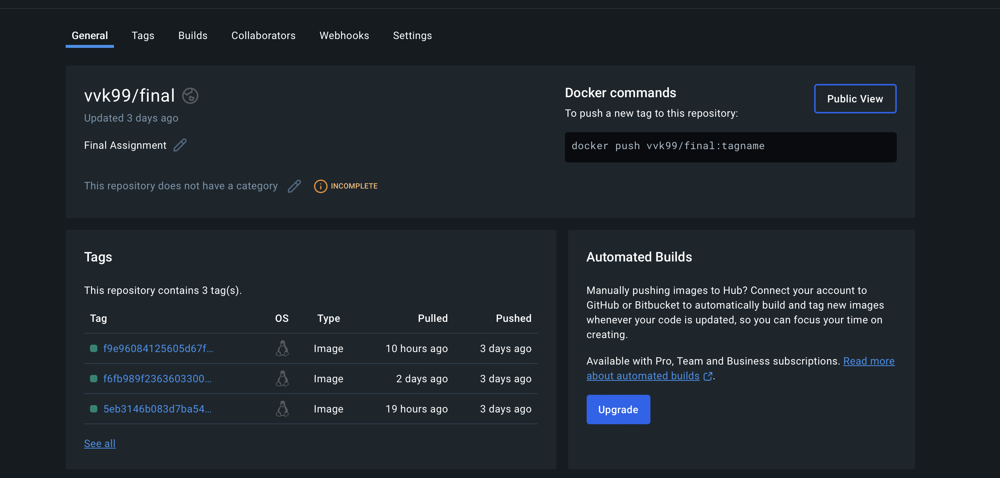

# The User Management System Final Project
## Overview:
Welcome to my project! My mission is to enhance Role-Based Access Control (RBAC) features, ensuring a robust and secure system. Focus on Quality Assurance by thoroughly testing major functionalities and identifying at least five bugs, documenting them with detailed GitHub issues. Improve test coverage by creating 10 additional tests for edge cases, error scenarios, and crucial functionalities like user registration, login, authorization, and database interactions. Implement the RBAC enhancements, adhering to the project's coding practices, and write comprehensive tests to ensure functionality and reliability. Maintain a working main branch deploying to Docker, ensuring a seamless and trouble-free submission process. Your efforts will be pivotal in making the system more secure and reliable—happy coding!

## Adding New Feature:  RBAC Enhancements
## 5 QA Issues
1. [Adding Endping called /user-role]()
2. [Logging the user role change event]()
3. [Adding filters to the endpoint to handle correct inputs]()
4. [Adding 10 test cases for user role change endpoint]()
5. [Dockerfile](https://github.com/vinaykath/finalassignment/pull/2)

## 10 New Test Cases
[Link to 10 new pytes file](./tests/test_users_role.py)

[10 Pyest Documentation](./Pytest.md)
1) Login as Admin, change User
2) Login as Admin, change Manager
3) Login as Admin, change Admin 

4) Login as Manager, change Admin
5) Login as Manager, change Manger
6) Login as Manager, change User

7) Login as User, change Admin
8) Login as User, change Manager
9) Login as User, change User

10) Role is missing in request that is sent

## 10 Commit history:
Over 10 commits has been made.

## DockerHub Repository and Image:
My project is successfully running, and its Docker image is stored in DockerHub for easy access and deployment. Below are the details of my DockerHub repository:
[Repository link](https://hub.docker.com/repository/docker/vvk99/final/general)

### Docker image upload

Hosting my Docker image on DockerHub ensures our application deploys smoothly and reaches users and collaborators effortlessly. These skills prepare me to manage complex software projects, contribute effectively to high-performing teams, and stay current with technology trends. They qualify me for diverse roles in tech, including coding and systems engineering, showcasing my readiness to learn and adapt, essential for advancing in the tech industry.

## What did I learn:
In IS601, I learned many important skills for modern software development. This summary explains what I learned in a simple way, perfect for beginners.

### Docker

Docker helps me with package applications and their settings into containers, which ensures they run the same way everywhere. I learned how to create and manage these containers, making it easier to deploy applications without worrying about environment differences. By hosting my Docker image on DockerHub, I ensure seamless deployment and distribution of our application. This allows users and collaborators to access the latest version of our application image with ease.

### Virtual Environment

Virtual environment let you create isolated spaces for each project so that dependencies don’t clash. I learned how to set up and use virtual environments with tools like venv and virtualenv, which keeps projects clean and manageable.

### PyTest

Testing your code is crucial. PyTest is a tool that helps you write and run tests for Python code. I learned to create test files, write test functions, and use PyTest features to ensure my code works correctly and stays bug-free.

### GitHub and GitHub Actions

GitHub is a platform for version control using Git. I learned how to manage code repositories, track changes, and collaborate with others. GitHub Actions automate tasks like running tests and deploying code, which makes the development process smoother and more efficient.

### API Development

APIs allow different software components to talk to each other. I learned the basics of creating and using APIs, which is important for building modern software applications.

### REPL (Read-Eval-Print Loop)

REPL environments let you test small pieces of code quickly and see the results immediately. This is useful for learning, debugging, and experimenting with new ideas.

### In conclusion:
In IS601, I gained essential skills in Docker, virtual environments, PyTest, GitHub, APIs, and REPL. These tools and practices are key to becoming a competent software developer. This course provided a strong foundation to build on and continue learning in the field of software development.